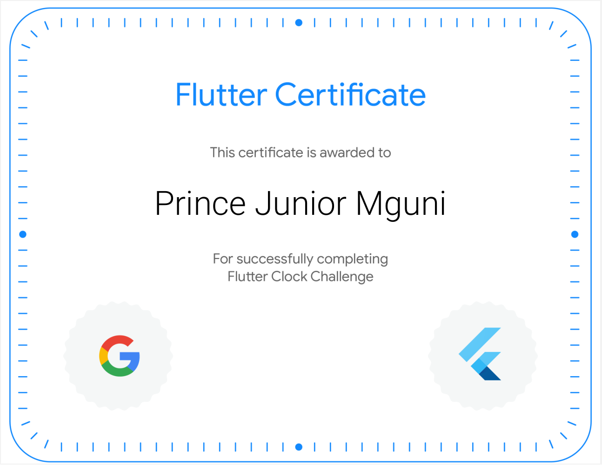

# Nixie Clock for the Flutter Clock Contest

A simple flutter app that displays a clock using Nixie tube images

Images by [olafpictures](https://pixabay.com/users/olafpictures-2427999/) on https://pixabay.com/

# To run

Clone this repo and run `cd digital_clock`
Then `flutter create .` to generate android and ios builds
and `flutter run` to run on emulator

# Certificate

[link](https://www.credential.net/1cdeafb8-de55-43a3-be96-0041ffd05085?key=5e24a52710f0fe347cbdbfd97974e018a9a52e74048471a2541c4c859a152fa3)
